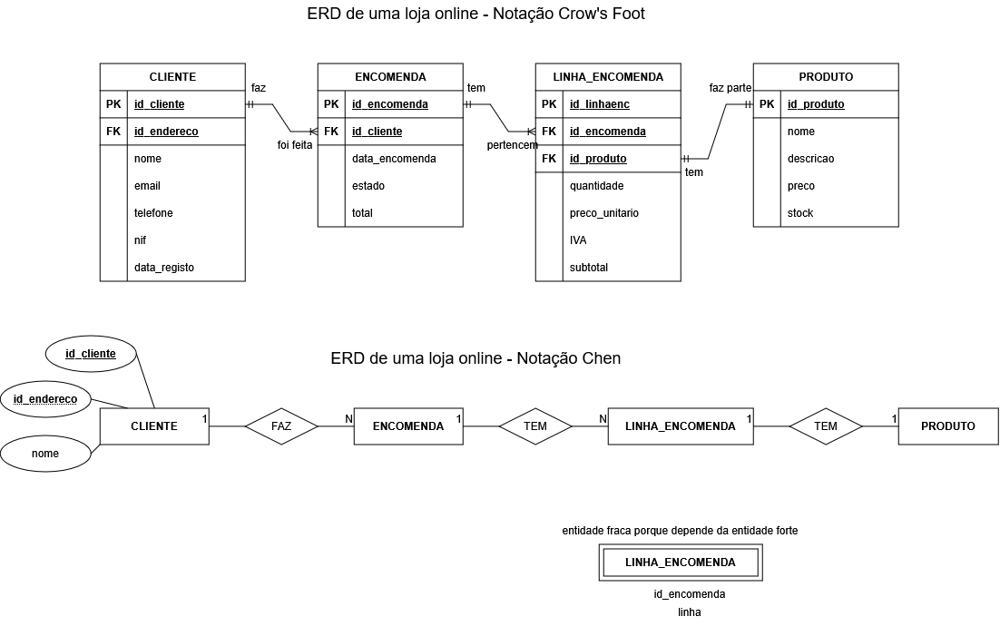
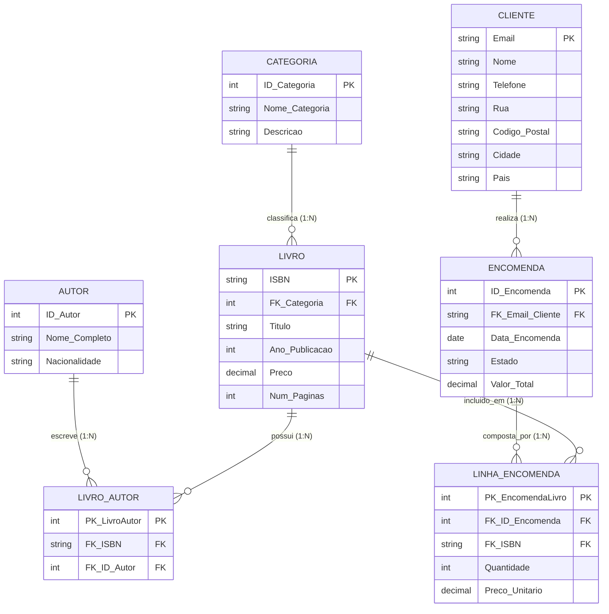
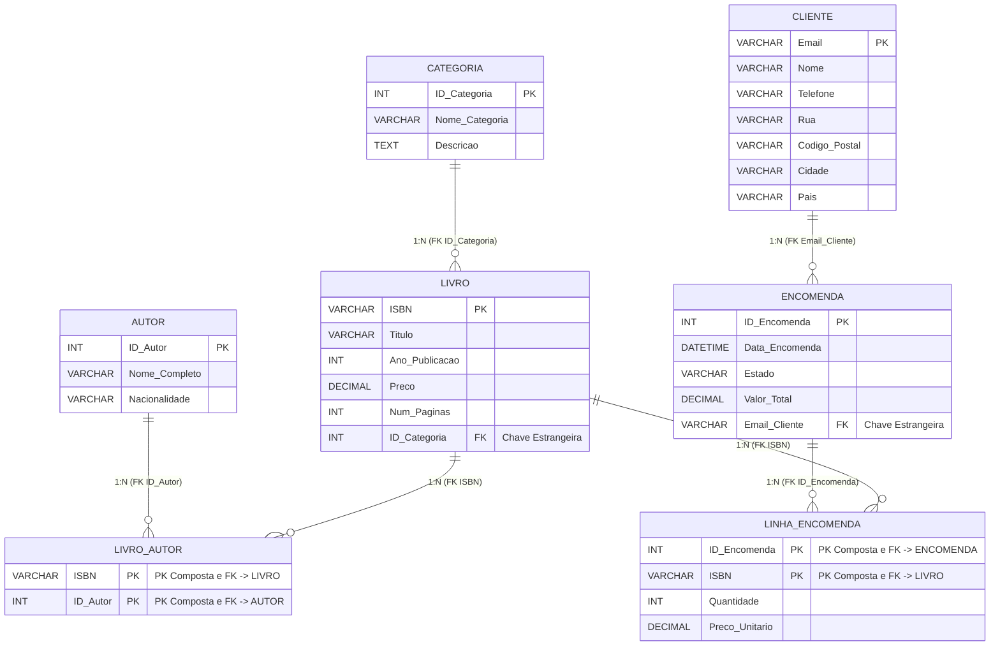

# Entity Relationship Diagram (ERD)
## Entidades
## Atributos
## Relacionamentos/Relações
## Cardinalidade das relações
## Participação nas relações
## Atributos das relações
## Entidades fracas
## Notações de ERD
- Notação de Chen (clássica)
- Notação Crow's Foot (pé de galinha)
- Notação UML

## APPS ÚTEIS

https://app.diagrams.net/

https://dbdiagram.io

https://miro.com

## 1. Modelo Relacional Conceitual Completo (ERD)

## 2. Conversão para Tabelas SQL (Prévia do Esquema Físico)

# LINKS ÚTEIS 

https://www.geeksforgeeks.org/sql/cascade-in-sql/

https://www.geeksforgeeks.org/mysql/datetime-vs-timestamp-data-type-in-mysql/

https://lucid.co/pt/diagrama/entidade-relacionamento/tutorial?usecase=erd
