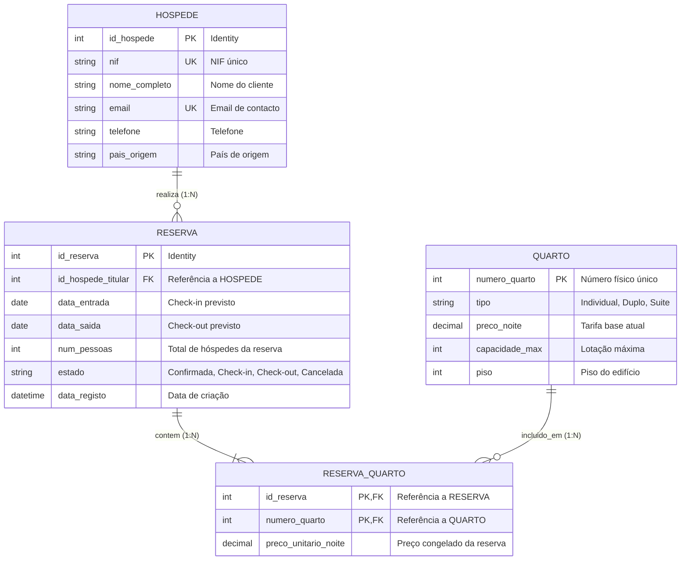
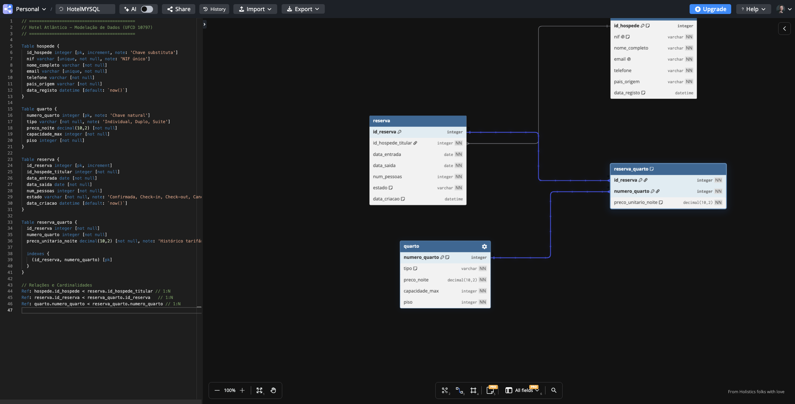

# UFCD 10797 — Bases de Dados
## Atividade 2 — Modelação de Sistema de Gestão Hoteleira (Hotel Atlântico)
**Formando:** André Luiz Sales Rodrigues  
**Data:** 25/09/2026  

---

## PARTE A — Análise e Identificação

### 1. Entidades Identificadas e Justificação
* **HOSPEDE:** Representa os clientes/utilizadores que se registam no sistema e realizam reservas. É uma entidade independente porque possui ciclo de vida próprio e dados que persistem mesmo sem reservas ativas.
* **QUARTO:** Representa as unidades de alojamento físicas do hotel. Existe independentemente de estar reservado ou ocupado.
* **RESERVA:** Representa o contrato/agendamento de alojamento feito por um hóspede titular para um determinado período.
* **RESERVA_QUARTO (Entidade Associativa):** Necessária para resolver a relação N:M entre RESERVA e QUARTO (uma reserva pode ter vários quartos e um quarto participa em várias reservas ao longo do tempo). Permite também guardar o preço histórico contratado por noite para cada quarto nessa reserva específica.

---

### 2. Atributos e Chaves Primárias

| Entidade | Atributos | Chave Primária (PK) | Tipo de Chave | Justificação |
| :--- | :--- | :--- | :--- | :--- |
| **HOSPEDE** | `nif`, `nome_completo`, `email`, `telefone`, `pais_origem` | `id_hospede` (ou `nif`) | **Substituta (`id_hospede` INT)** *(com `nif` e `email` UNIQUE)* | Chaves substitutas inteiras garantem melhor desempenho de indexação e evitam problemas com hóspedes estrangeiros sem NIF português. |
| **QUARTO** | `numero_quarto`, `tipo` (Individual, Duplo, Suite), `preco_noite`, `capacidade_max`, `piso` | `numero_quarto` | **Natural (`numero_quarto` INT)** | O número do quarto é único no edifício, estável e identifica diretamente a unidade física. |
| **RESERVA** | `id_reserva`, `data_entrada`, `data_saida`, `num_pessoas`, `estado` (Confirmada, Check-in, Check-out, Cancelada), `data_registo` | `id_reserva` | **Substituta (`id_reserva` INT IDENTITY)** | Uma reserva é um evento transacional; um identificador autoincrementado é a melhor prática padrão. |
| **RESERVA_QUARTO** | `id_reserva`, `numero_quarto`, `preco_unitario_noite` | `(id_reserva, numero_quarto)` | **Composta (FK `id_reserva` + FK `numero_quarto`)** | Garante que o mesmo quarto não é duplicado dentro da mesma reserva. |

---

### 3. Relações entre Entidades

1. **HOSPEDE realiza RESERVA:**
   * Entidades: `HOSPEDE` (1) ←→ `RESERVA` (N)
   * Verbo: *realiza* / *efetua*
2. **RESERVA inclui QUARTO:**
   * Entidades: `RESERVA` (N) ←→ `QUARTO` (M) via associativa `RESERVA_QUARTO`
   * Verbo: *inclui* / *contém*

---

## PARTE B — Determinação de Cardinalidades

### 1. Análise Racional das Cardinalidades

#### Relação 1: HOSPEDE ←→ RESERVA
* **Pergunta A:** Quantas reservas pode fazer um hóspede?  
  *Resposta:* Várias (0 a N, ao longo do tempo).
* **Pergunta B:** Quantos hóspedes titulares pode ter uma reserva?  
  *Resposta:* Exatamente um (1). O enunciado indica: *"Cada reserva é feita por um único hóspede (titular da reserva)"*.
* **Cardinalidade:** **1:N** (Um Hóspede pode ter Muitas Reservas; Cada Reserva pertence a Um único Hóspede).

#### Relação 2: RESERVA ←→ QUARTO
* **Pergunta A:** Quantos quartos pode incluir uma reserva?  
  *Resposta:* Um ou vários (1 a N). O enunciado indica: *"Uma reserva pode incluir um ou mais quartos (por exemplo, uma família pode reservar dois quartos duplos na mesma reserva)"*.
* **Pergunta B:** Quantas reservas pode ter um quarto?  
  *Resposta:* Várias (0 a N, em datas distintas ao longo do tempo).
* **Cardinalidade:** **N:M** (Muitos para Muitos). Exige tabela associativa intermediária (`RESERVA_QUARTO`).

---

### 2. Atributos Próprios de Relações
* **Sim**, a relação entre `RESERVA` e `QUARTO` possui um atributo crítico: **`preco_unitario_noite`**.
  * **Justificação:** O preço do quarto na tabela `QUARTO` pode sofrer alterações ao longo das épocas (alta/baixa estação) ou atualizações tarifárias. Se não guardarmos o preço praticado no momento em que a reserva foi fechada na tabela associativa, relatórios financeiros ou conferências de check-out alterariam retroativamente os valores faturados.

---

## PARTE C — Diagrama Entidade-Relacionamento (ERD)

### Notação Crow's Foot (Mermaid)

### Diagrama Exportado do dbdiagram.io

---

## PARTE D — Validação e Reflexão

### 1. Validação com Perguntas Práticas de Negócio

1. **Consigo saber todas as reservas que um hóspede já fez?**  
   *Sim.* Através de um `SELECT * FROM RESERVA WHERE id_hospede_titular = @id_hospede` ou fazendo um `JOIN` entre `HOSPEDE` e `RESERVA` pela chave estrangeira `id_hospede_titular`.
2. **Consigo saber que quartos estão incluídos numa reserva específica?**  
   *Sim.* Consultando a tabela associativa `RESERVA_QUARTO` filtrando por `id_reserva`, podendo fazer `JOIN` com `QUARTO` para obter tipo, piso e detalhes do quarto.
3. **Consigo listar todos os quartos do tipo "Suite"?**  
   *Sim.* Através de `SELECT * FROM QUARTO WHERE tipo = 'Suite'`.
4. **Consigo saber quantas pessoas ficarão num quarto específico numa reserva?**  
   *Com o modelo base do enunciado:* Sabemos o total de pessoas da reserva global (`num_pessoas` em `RESERVA`). Se for necessário saber a alocação exata de pessoas por cada quarto, pode adicionar-se o campo `num_ocupantes` na tabela `RESERVA_QUARTO`.
5. **Se um quarto mudar de preço, isso afeta reservas já feitas?**  
   *Não.* Porque o preço histórico contratado é gravado em `RESERVA_QUARTO.preco_unitario_noite` no momento da criação da reserva, preservando a imutabilidade fiscal e auditoria financeira.

---

### 2. Reflexão Crítica e Melhorias

* **Informação não totalmente coberta pelo enunciado simples:**  
  O enunciado menciona que a reserva é feita para várias pessoas, mas apenas regista os dados do titular. Se a legislação hoteleira/SEF/polícia exigir a identificação de todos os ocupantes reais dos quartos (e não apenas do titular), seria necessário uma entidade `OCUPANTE_RESERVA`.
* **Ambiguidade identificada:**  
  Não há indicação se o cancelamento tem taxa ou data limite, nem como é gerido o overbooking ou manutenção de quartos indisponíveis.
* **Pergunta à Direção do Hotel:**  
  *"É necessário registar individualmente a identificação legal (passaporte/cartão de cidadão) de cada acompanhante que pernoita nos quartos, ou apenas o titular da reserva é suficiente para a faturação e check-in?"*
